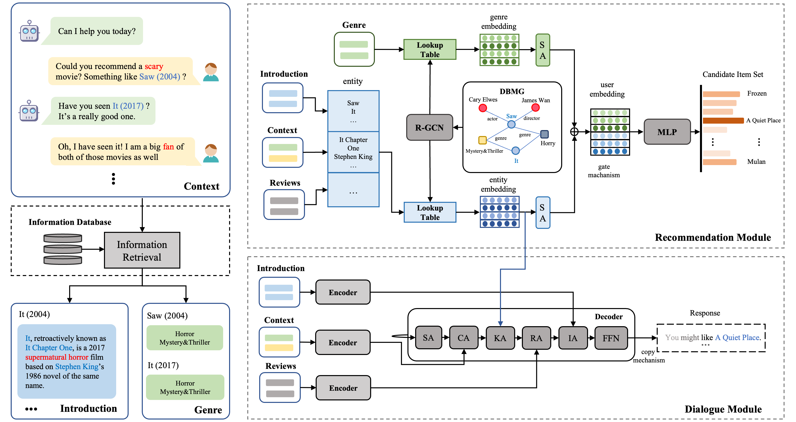

# MACR

> Chengyang Zhang, Xianying Huang*, Jiahao An. 
> 
> ***[MACR: Multi-information Augmented Conversational Recommender](https://www.sciencedirect.com/science/article/pii/S0957417422019996)***


Conversational recommender systems (CRS) aim to provide high-quality recommendations through fewer multi-turn conversations. 
However, because short conversation histories lack sufficient item information, CRSs not only struggle to make accurate recommendations but also lack diversity in the generated responses. 
Existing CRSs mainly alleviate these problems by introducing external information (e.g., reviews) while ignoring information inside the conversations ($\textit{e.g.,}$ potential category preferences in user utterances). 
Besides, item introduction is a kind of external information that is more objective and contains more entities than reviews. 



Therefore, we propose a Multi-information Augmented Conversational Recommender (MACR), which improves the performance of recommendation and response generation by mining the underlying category preferences in users' utterances and incorporating item introductions. 
Specifically, we enhance the category associations among entities by constructing a knowledge graph DBMG with category nodes,  extracting and encoding the item categories that match the user preferences into the user representation. 
For item introductions, we extract the entities in them and fuse them into the conversation using an introduction-attentive encoder-decoder.

# Download Data

Please download data from the [link](https://drive.google.com/drive/folders/14O6DbECu4efkrmtFacU3kT0lPYXLu2CJ?usp=sharing), after unzipping, move it into `src/data/`.

# Environment 
- python == 3.6.1
- pytorch == 1.7.0 
- torch_geometric == 2.0.1
- cuda == 11.0 


# Run
Run the recommendation module:

```python run_train_test_copy.py```

Run the dialogue module:

```python run_train_test_copy.py --is_finetune True```


# Thanks for your citation
```c
@article{ZHANG2023118981,
title = {MACR: Multi-information Augmented Conversational Recommender},
journal = {Expert Systems with Applications},
volume = {213},
pages = {118981},
year = {2023},
issn = {0957-4174},
doi = {https://doi.org/10.1016/j.eswa.2022.118981},
url = {https://www.sciencedirect.com/science/article/pii/S0957417422019996},
author = {Chengyang Zhang and Xianying Huang and Jiahao An},
keywords = {Conversational recommender system, Knowledge graph, Category information, Item introduction}
}
```


